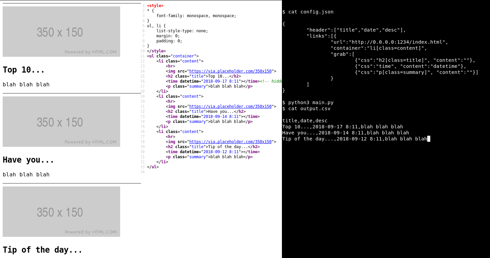

# EZWS
Easy Web Scrape: using CSS selectors to scrape a list of webpages

# Usage

By looking at a pages HTML source, you can use CSS selectors to parse data into a csv

Use lots of links, each one having a container tag, and CSS selectors that grab desired data from the container

Below is a simple use case that grabs blog information

# Note

Until pic is changed, "content" has been changed to "contents", and requires an array of strings instead of one

This allows you to grab many attributes of the same element
